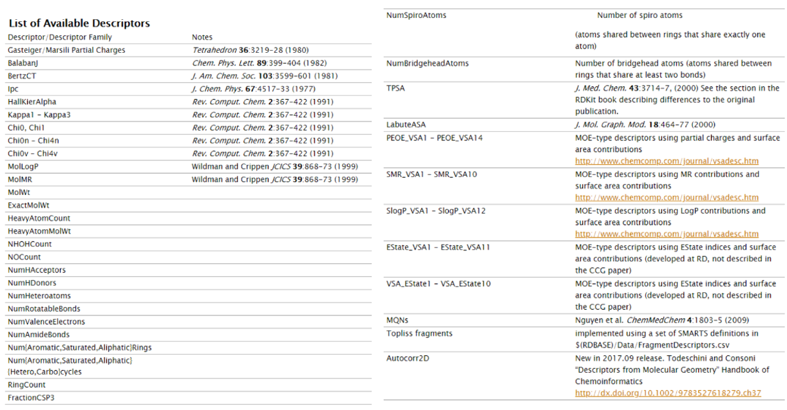

```{r setup, echo=FALSE, cache=FALSE}
library(knitr)
library(rmdformats)

## Global options
options(max.print="75")
opts_chunk$set(echo=FALSE,
	             # cache=TRUE,
               prompt=FALSE,
               tidy=TRUE,
               comment=NA,
               message=FALSE,
               warning=FALSE)
opts_knit$set(width=75)
```

```{r libraries, echo = FALSE, message = FALSE, warning = FALSE}
library(knitr)
library(kableExtra)
library(tidyverse)
library(readxl)
library(janitor)
library(here)
library(dplyr)
# library(reticulate)
# use_python("C:/Users/us16120/Anaconda3/python.exe")
library(caret)
library(ggplot2)
library(ggthemes)
library(corrplot)
library(randomForest)
library(e1071)
library(hydroGOF)
library(rsq)
library(plotly)

set.seed(42)
```

# Introduction  

**Daphnia magna** is a small planktonic crustacean (adult length 1.5–5.0 mm) that belongs to the subclass Phyllopoda. It inhabits a variety of freshwater environments, ranging from acidic swamps to rivers made of snow runoff, and is broadly distributed throughout the Northern Hemisphere and South Africa.  

In the recent years, ecotoxicological hazard potential of biocidal products has been receiving increasing attention in the industries and regulatory agencies. Biocides/pesticides are currently one of the most studied groups of compounds, and their registration cannot be done without the empirical toxicity information. In view of limited experimental data available for these compounds, we have developed Quantitative Structure-Activity Relationship (QSAR) models for the toxicity of biocides to Daphnia magna following principles of QSAR modeling recommended by the OECD (Organization for Economic Cooperation and Development).  

# Data Retrieval  

```{r access_data, message = FALSE, warning = FALSE}
# path_to_data <- here('data', 'Khan_Chemosphere_229_8.xlsx')
# 
# df <-
#   readxl::read_xlsx(path_to_data, sheet = 'Daphnia Dataset')  %>%
#   data.frame() %>%
#   janitor::clean_names()

df <- read.csv('data/Khan_data.csv', stringsAsFactors = FALSE)
# names(df)

# df <- df %>%
#   select(cas_number, canonical_smiles, p_ec50_mol_l_daphnia) %>%
#   rename('CAS' = 'cas_number',
#          'SMILES' = 'canonical_smiles',
#          'pEC50' = 'p_ec50_mol_l_daphnia')
```

Data was retrieved from K.Khan, *et al.*, **QSAR Modeling of Daphnia Magna and Fish Toxicities of Biocides Using 2D Descriptors** Chemosphere, **229** (2019) 8 - 17.  

Experimental results were reported for `r nrow(df)` molecules (observations).  

```{r data_table, message = FALSE, warning = FALSE}
# head(df)
kable(df[ , 1:3]) %>%
  kable_styling(bootstrap_options = c("striped", "hover", "condensed"), font_size = 11) %>%
  scroll_box(height = "200px")
```
<br>
The **pEC50** is defined as the negative logarithm of the EC50. If the EC50 equals 1 micromolar (10-6 molar), the log(EC50) is -6 and the pEC50 is 6. The advantage to expressing potency this way is that drugs with larger pEC50 values are more potent.  

```{r pEC50_plot, message = FALSE, warning = FALSE}
ggplot(df, aes(x = pEC50)) +
  geom_histogram(
    aes(y = ..density..),
    # Histogram with density instead of count on y-axis
    binwidth = 0.25,
    colour = "black",
    fill = "white"
  ) +
  geom_density(alpha = .2, fill = "#FF6666")  # Overlay with transparent density plot
```

```{r pEC50_plot2, message = FALSE, warning = FALSE}
p <- ggplot(df, aes(x = pEC50)) +
  geom_histogram(
    aes(y = ..density..),
    # Histogram with density instead of count on y-axis
    binwidth = 0.25,
    colour = "black",
    fill = "white"
  ) +
  geom_density(alpha = .2, fill = "#FF6666")  # Overlay with transparent density plot
ggplotly(p)
```

# Calculate Predictors  

RDKit was used to calculate 200 predictors (variables) for each of the `r nrow(df)` molecules. The **SMILES** strings were used to encode the molecules.



```{r echo = FALSE}
kable(df) %>%
  kable_styling(bootstrap_options = c("striped", "hover", "condensed"), font_size = 11) %>%
  scroll_box(height = "200px")
```

```{r echo = FALSE}
str(df)
``` 

# Training Set & Test Set  

```{r echo = FALSE}
in_train <-
  createDataPartition(df$pEC50
                      , p = 0.8
                      , list = FALSE)
train <- df[in_train,] %>%
  mutate(set = 'train') %>%
  data.frame()
test <- df[-in_train,] %>%
  mutate(set = 'test') %>%
  data.frame()
```

A stratified data selection scheme was used to build a training set and a test set from the extant data. 80% of the data (`r nrow(train)` molecules) was used for training; 20% of the data (`r nrow(test)` molecules) was used for model validation.  

```{r echo = FALSE}
X_train <- train %>%
  select(-CAS, -SMILES, -pEC50, -set) %>%
  data.frame()
# dim(X_train)
X_test <- test %>%
  select(-CAS, -SMILES, -pEC50, -set) %>%
  data.frame()
# dim(X_test)
y_train <- train %>%
  select(pEC50) %>%
  data.frame()
colnames(y_train) <- c('Observed')
# dim(y_train)
y_test <- test %>%
  select(pEC50) %>%
  data.frame()
colnames(y_test) <- c('Observed')
# dim(y_test)
```

The density plot shows the distribution of pEC50 values in the training set and in the test set.  

```{r echo = FALSE}
data2plot <- rbind(train, test) %>%
  data.frame()
ggplot(data2plot, aes(x = pEC50, fill = set)) + geom_density(alpha = .3) +
  ggthemes::theme_tufte()
```

# Data Curation 

Starting with `r ncol(X_train)` calculated predictors:  

1. Remove **near-zero variation predictors**  

```{r echo = FALSE}
nzv <- nearZeroVar(X_train, freqCut = 100 / 0)
# length(nzv)
# names(X_train[ , nzv])
X_train_nzv <- X_train[ , -nzv]
X_test_nzv <- X_test[ , -nzv]
```

There are `r length(nzv)` near-zero variance predictors:
<br>
`r names(X_train[ , nzv])`
<br>
... `r ncol(X_train_nzv)` predictors remain.
<br>

2. Remove **highly correlated predictors**  

```{r echo = FALSE}
par(mfrow=c(1,2))

correlations <- cor(X_train_nzv)
# corrplot(correlations, order = "hclust", tl.cex = 0.25)

highCorr <- findCorrelation(correlations, cutoff = 0.8)
# length(highCorr)
# names(X_train_nzv[ , highCorr])
X_train_curated <- X_train_nzv[ , -highCorr]
X_test_curated <- X_test_nzv[ , -highCorr]

correlations <- cor(X_train_curated)
# corrplot(correlations, order = "hclust", tl.cex = 0.5)
```

There are `r length(highCorr)` highly correlated predictors:
<br>
`r names(X_train_nzv[ , highCorr])`
<br>
... `r ncol(X_train_curated)` predictors remain.
<br>

3. Center and scale the remaining predictors. This does not impact the number of predictors.  

# Model: Random Forest Regression  

Build a random forest model:

```{r echo = TRUE}
trainSet <- cbind(y_train, X_train_curated) %>%
  rename(pEC50 = Observed)
testSet <- cbind(y_test, X_test_curated) %>%
  rename(pEC50 = Observed)
rfModel <- randomForest(
  pEC50 ~ .,
  data = trainSet,
  importance = TRUE,
  ntrees = 1000
)
```

```{r echo = FALSE}
print(rfModel)
```

```{r echo = FALSE}
varImpPlot(rfModel, type = 1, main = 'Variable Importance Plot')
```

<br>

Test Data:

```{r echo = FALSE}
y_predict <- predict(rfModel, newdata = X_test_curated) %>%
  data.frame()
colnames(y_predict) <- c('Predicted')
data2plot <- cbind(y_test, y_predict)

rf_test <- lm(Observed ~ Predicted, data = data2plot)

summary(lm(Observed ~ Predicted, data = data2plot))
```

```{r}
p <-
  ggplot(data2plot, aes(Predicted, Observed)) +
  geom_point(colour = "blue", size = 2) +
  coord_equal() +
  # xlim(c(0, 3.5)) + ylim(c(0, 3.5)) +
  geom_smooth(method = 'lm') +
  labs(title = 'pEC50',
       subtitle = 'Random Forest\n test data') +
  ggthemes::theme_tufte()
p <- p + geom_abline(intercept = 0,
                     slope = 1,
                     colour = 'red')
p
```
<br>

Training Data:

```{r}
y_predict <- predict(rfModel, newdata = X_train_curated) %>%
  data.frame()
colnames(y_predict) <- c('Predicted')
data2plot <- cbind(y_train, y_predict)

rf_train <- lm(Observed ~ Predicted, data = data2plot)

summary(lm(Observed ~ Predicted, data = data2plot))
```

```{r}
p <-
  ggplot(data2plot, aes(Predicted, Observed)) +
  geom_point(colour = "blue", size = 2) +
  coord_equal() +
  # xlim(c(0, 3.5)) + ylim(c(0, 3.5)) +
  geom_smooth(method='lm') +
  labs(title = 'pEC50',
       subtitle = 'Random Forest\n training data') +
  ggthemes::theme_tufte()
p <- p + geom_abline(intercept = 0,
                     slope = 1,
                     colour = 'red')
p
```

# Model: Support Vector Machine Regression  

Build a support vector machine model:

```{r echo = TRUE}
svmModel = svm(pEC50 ~ .,
  data = trainSet)
```

```{r echo = FALSE}
print(svmModel)
```

<br>

Test Data:  

```{r echo = FALSE}

y_predict <- predict(svmModel, newdata = X_test_curated) %>%
  data.frame()
colnames(y_predict) <- c('Predicted')

data2plot <- cbind(y_test, y_predict)

svm_test <- lm(Observed ~ Predicted, data = data2plot)

summary(lm(Predicted ~ Observed, data = data2plot))
```

```{r eval = FALSE}
## Calculate parameters of the SVR model

# Find value of W
test_W = t(svmModel$coefs) %*% svmModel$SV

# Find value of b
test_b = svmModel$rho

testRMSE = rmse(data2plot$Predicted, data2plot$Observed)
```

```{r echo = FALSE}
p <-
  ggplot(data2plot, aes(Predicted, Observed)) +
  geom_point(colour = "blue", size = 2) +
  coord_equal() +
  # xlim(c(0, 3.5)) + ylim(c(0, 3.5)) +
  geom_smooth(method = 'lm') +
  labs(title = 'pEC50',
       subtitle = 'SVM\n test data') +
  ggthemes::theme_tufte()
p <- p + geom_abline(intercept = 0,
                     slope = 1,
                     colour = 'red')
p
```
<br>

Training Data:

```{r echo = FALSE}
y_predict <- predict(svmModel, newdata = X_train_curated) %>%
  data.frame()
colnames(y_predict) <- c('Predicted')

data2plot <- cbind(y_train, y_predict)

svm_train <- lm(Observed ~ Predicted, data = data2plot) 

summary(lm(Observed ~ Predicted, data = data2plot))
```

```{r eval = FALSE}
## Calculate parameters of the SVR model

# Find value of W
train_W = t(svmModel$coefs) %*% svmModel$SV

# Find value of b
train_b = svmModel$rho

trainRMSE = rmse(data2plot$Predicted, data2plot$Observed)
```

```{r echo = FALSE}
p <-
  ggplot(data2plot, aes(Predicted, Observed)) +
  geom_point(colour = "blue", size = 2) +
  coord_equal() +
  # xlim(c(0, 3.5)) + ylim(c(0, 3.5)) +
  geom_smooth(method='lm') +
  labs(title = 'pEC50',
       subtitle = 'SVM\n training data') +
  ggthemes::theme_tufte()
p <- p + geom_abline(intercept = 0,
                     slope = 1,
                     colour = 'red')
p
```  

# Summary  


| Algorithm     | Train             | Test              |
| ------------- |:-----------------:| -----------------:|
| Random Forest | `r rsq(rf_train)` | `r rsq(rf_test)`  |
| SVM           | `r rsq(svm_train)`| `r rsq(svm_test)` |


# Conclusion(s)  

Based on the R^2^ values reported for the test datasets (Random Forest : `r rsq(rf_test)`; Support Vector Machine: `r rsq(svm_test)`), the random forest algorithm is preferred over the support vector machine algorithm.
