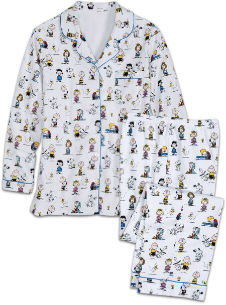
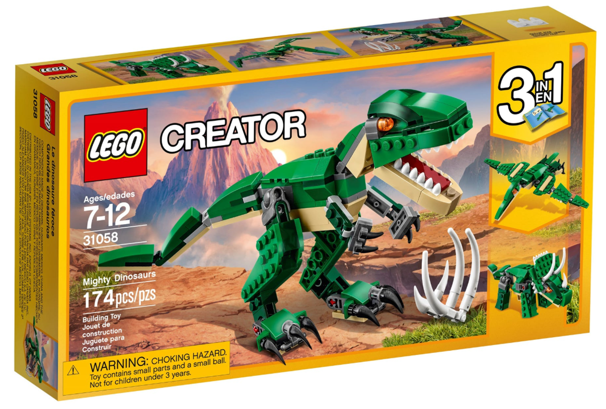

## Happy to hear from you ...

- pauljkowalczyk@gmail.com
- linkedin.com/in/pauljkowalczyk/
- github.com/pjkowalczyk

## Data Science Bucket List


\checkmark Attend a DataPhilly meeting wearing pajamas.
```{r fig.align="center", echo = FALSE, out.width = '100px'}

```

## In all sincerity ...

... I hope that you, your family, and your friends are well.  

\bigskip
\bigskip

And I thank you for taking time today to attend this practicum.

## Cuppa Calculations

\begin{table}
\centering
\caption*{\textbf{RECOMMENDED BREW TIMES}}
\begin{tabular}{ll}
\toprule
\textbf{Tea Type} 	&  \textbf{Brew Time} 	\\ 
\midrule
Black 	& 4 mins 	\\
Chai 	& 5 mins 	\\
Green 	& 2 mins 	\\
Herbal  &  4 mins \\
Red  &  4 mins  \\
Oolong  &  3 mins  \\
White  &  1 min  \\
Cold Brewed Iced Tea  &  5 mins \\
\bottomrule
\end{tabular}
\end{table}

\footnotesize https://twiningsusa.com/pages/how-to-brew-the-perfect-cup-of-tea

## Practicum

\Large Merriam-Webster: "a course of study ... that involves the supervised \underline{practical} application of previously studied theory" 

\large from the Latin, neuter of *practicus*: practical

## Reproducibility: Transparency

```{r fig.align="center", echo = FALSE, out.width = '85px'}
knitr::include_graphics("images/SkeletonWatch.png")
```

## Reproducibility: Interoperability

```{r fig.align="center", echo = FALSE, out.width = '250px'}

```

## (Purposefully) Serverless

```{r fig.align="center", echo = FALSE, out.width = '100px'}

```

- deliver narratives via \*.html, \*.pdf, \*.doc, and \*.pptx
- maintain interactivity

## Workflow View - from a distance

\begin{center}
\smartdiagram[sequence diagram]{script,notebook,narrative}
\end{center}

- script: \*.r, \*.py
- notebook: \*.Rmd, \*.ipynb
- narrative: \*.html, \*.pdf, \*.pptx, \*.doc

\bigskip

The actual code is the same throughout. The difference is in how that code is **decorated**.

## The Narratives' Audience

\begin{description}
  \item[Creator] \hfill \\ develops a computational solution to a problem; writes (\& comments!) the scripts
  \item[Curator] \hfill \\ uses the scripts:
    \begin{itemize}
      \item same script / different data
      \item repurposes the script
      \item expands the script
      \item \ldots
    \end{itemize}
  \item[Consumer] \hfill \\ exploits the actionable insights delivered in the narratives
\end{description}

\bigskip

\begin{center}
These roles are not mutually exclusive.  
\end{center}

## Dataset Template

\begin{table}
\centering
\begin{tabular}{|c|c|c|c|c|c|c|}
\toprule
\textbf{ID} 	&  \textbf{EndPt}  & \textbf{x\textsubscript{1}}  & \textbf{x\textsubscript{2}}  & \textbf{x\textsubscript{3}} & \ldots & \textbf{x\textsubscript{n}}\\ 
\midrule
ID\textsubscript{1} 	& y\textsubscript{1} & x\textsubscript{1,1}  & x\textsubscript{1,2}  & x\textsubscript{1,3}	& \ldots  & x\textsubscript{1,n}\\
\hline
ID\textsubscript{2} 	& y\textsubscript{2} & x\textsubscript{2,1}  & x\textsubscript{2,2}  & x\textsubscript{2,3}	& \ldots  & x\textsubscript{2,n}\\
\hline
ID\textsubscript{3} 	& y\textsubscript{3} & x\textsubscript{3,1}  & x\textsubscript{3,2}  & x\textsubscript{3,3} & \ldots  & x\textsubscript{3,n}	\\
\hline
\ldots 	& \ldots & \ldots & \ldots  & \ldots & \ldots & \ldots \\
\hline
ID\textsubscript{m} 	& y\textsubscript{m} & x\textsubscript{m,1}  & x\textsubscript{m,2}  & x\textsubscript{m,3}	& \ldots  & x\textsubscript{m,n}\\
\bottomrule
\end{tabular}
\end{table}

- **m** rows $\equiv$ samples
- **n** columns $\equiv$ features
- **EndPt** $\equiv$ dependent variable
- **x** $\equiv$ independent variable

\medskip

\footnotesize To use a local dataset with the code from these exercises, label the column of identifiers **ID** (note capitalization), and label the column of dependent variables (**y**) **EndPt** (again, note capitalization).

## Confusion Matrices

\begin{center}
\begingroup
\tiny
\begin{tabular}{ c c c c c c c c }
\multicolumn{2} {c} {\bfseries Form I} & & & & \multicolumn{2} {c} {\bfseries Form II} & \\
\cline{1-3} \cline{6-8} \\
 & \multicolumn{2} {c} {\bfseries Prediction} & & & & \multicolumn{2} {c} {\bfseries True Label}\\
\cline{2-3} \cline{7-8} \\
 \bfseries True Label & \bfseries Negative & \bfseries Positive & & & \bfseries Prediction & \bfseries Positive & \bfseries Negative \\ 
  \cline{1-3} \cline{6-8} \\
 \bfseries Negative & TN & FP & & & Positive & TP & FP \\  
 \cline{1-3} \cline{6-8} \\
 \bfseries Positive & FN & TP & & & Negative & FN & TN   \\
  \cline{1-3} \cline{6-8} 
\end{tabular}
\endgroup
\end{center}
\begingroup
\tiny
\textbf{Form I}: Zumel & Mount 'Practical Data Science with R'; scikit-learn  
\textbf{Form II}: R::caret
\endgroup
\bigskip

\begin{center}
Accuracy $= \frac{TP + TN}{TP + FP + FN + TN}$  \\
\medskip
Kappa $= \frac{2*(TP*TN - FN*FP)}{(TP + FN)(FN+TN) + (TP + FP)(FP + TN)}$ \\
\medskip
Sensitivity $= \frac{TP}{TP + FN}$  \\
\medskip
Specificity $= \frac{TN}{FP + TN}$
\end{center}