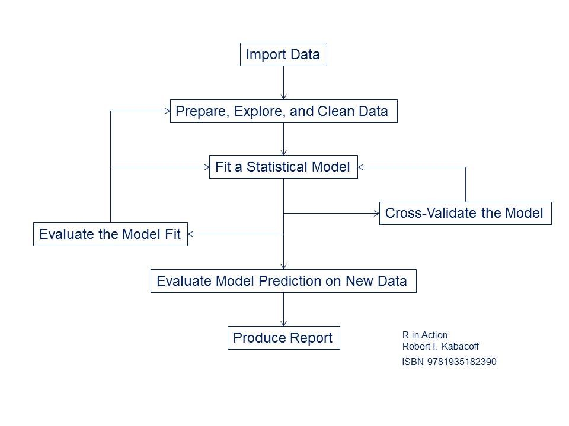
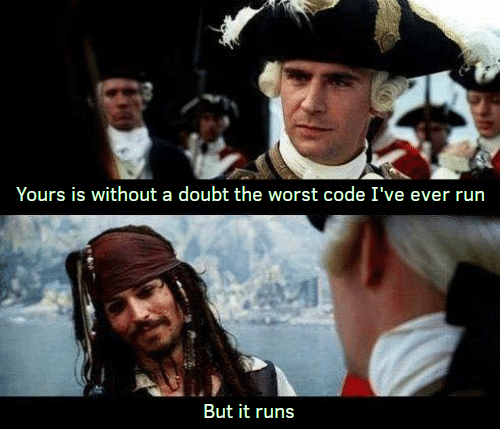

```{r setup, include=FALSE}
if(!require(pacman)) install.packages("pacman")
pacman::p_load('knitr', 'markdown', 'utils', 'ggplot2')
knitr::opts_chunk$set(echo = FALSE)
```

## Overview

This workshop will take one through the steps associated with an end-to-end machine learning campaign: data retrieval; data curation; model construction, evaluation, selection and interpretation; and reporting. Particular attention will be paid to reporting, i.e., building a narrative. Examples will be presented demonstrating how one might generate multiple output formats (e.g., HTML pages, presentation slides, PDF documents) starting with the same code base.  

As a specific example, a data narrative will be built showing how one might build predictive models for the toxicity of organic molecules. Reports will be presented as (1) an HTML file, (2) a PDF or Word document (in a format acceptable for journal submission), and (3) a slide presentation.  

While the workshop’s example comes from the field of cheminformatics, the computational tools used and the exercises presented are applicable to any field where an investigator is interested in building predictive models, and describing these models to colleagues and associates.  

At the workshop’s conclusion attendees will have worked through exercises that may serve as templates to be used with their data as they build their data narratives.

## A machine learning workflow

<h2>R in Action</h2>
<center>

</center>  

## Data Summary

```{r data_summary, echo = FALSE, fig.align = 'center'}
qaz <- read.csv('data/H3.csv')
ggplot2::ggplot(data = qaz, aes(x = pKi)) +
  geom_histogram(binwidth = 0.1, color="darkblue", fill="lightblue") +
  ggtitle("Assay Results", subtitle = "Distributiuon of pKi Data")
```

## Disclaimer

```{r JackSparrow, echo=FALSE, fig.cap="A pirate codes...", fig.align = 'center'}

```
